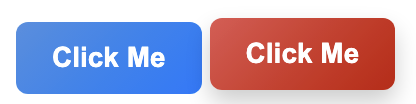
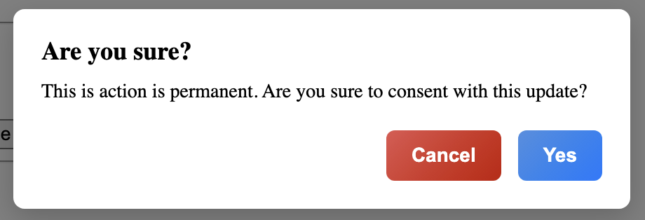
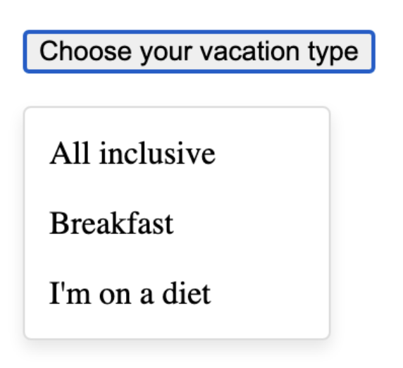
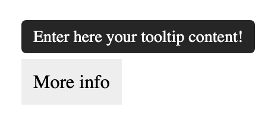

# UI Library

- A lightweight UI component library including Tooltip, Dropdown, Button, and Dialog.
- Built with vanilla JavaScript and CSS, bundled using Webpack with Babel for modern JS support.

---

## Installation

Clone the repo and install dependencies:

```bash
npm install
```

---

## Build & Development

- Build production bundle:

```bash
npm run build
```

- Start development server with live reload:

```bash
npm run serve
```

---

## Usage

Include the bundled script in your HTML:

```html
<script src="assets/bundle.js"></script>
```

---

## Examples

### Button



Renders buttons with ripple effect. Variants: `primary`, `secondary`.

**HTML:**

```html
<button data-button data-variant="primary">Click Me</button>
<button data-button data-variant="secondary">Click Me</button>
```

---

### Dialog



Modal dialog with open/close support triggered by buttons.

**HTML:**

```html
<button data-button data-variant="primary" data-dialog-target="#myDialog">
  Confirm
</button>

<div class="ui-dialog" id="myDialog">
  <div class="ui-dialog__content">
    <div class="ui-dialog__header">Are you sure?</div>
    <div class="ui-dialog__body">
      This action is permanent. Are you sure to consent?
    </div>
    <div class="ui-dialog__footer">
      <button data-dialog-close data-button data-variant="secondary">
        Cancel
      </button>
      <button data-dialog-close data-button data-variant="primary">Yes</button>
    </div>
  </div>
</div>
```

---

### Dropdown



Toggleable dropdown menu.

**HTML:**

```html
<div style="position: relative; display: inline-block;">
  <button data-dropdown>Choose your vacation type</button>
  <ul class="dropdown-menu">
    <li>All inclusive</li>
    <li>Breakfast</li>
    <li>I'm on a diet</li>
  </ul>
</div>
```

---

### Tooltip



Shows a tooltip message on hover.

**HTML:**

```html
<div
  data-message="Enter here your tooltip content!"
  style="margin: 50px; display: inline-block; padding: 10px; background: #eee;"
>
  More info
</div>
```
